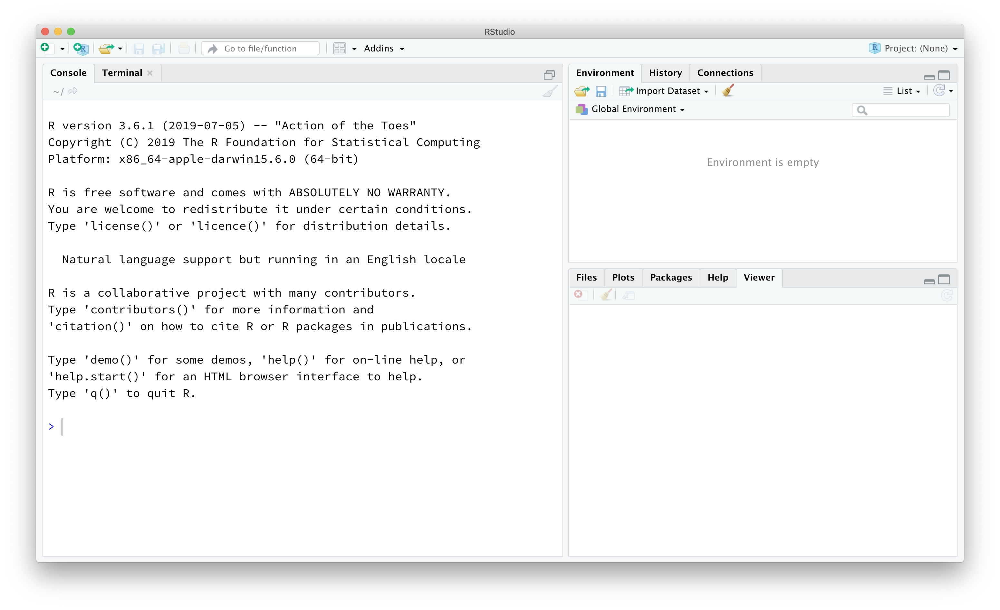

```{r, include = FALSE}
knitr::opts_chunk$set(
  collapse = TRUE,
  comment = "#>"
)
```

```{r setup, message=FALSE, eval=FALSE}
library(StatTheoryLabs)
```

## Logistics

This pre-lab will be done indivdually and in advance of the first lab. Ideally, everyone will come to the first lab knowing how to use the RStudio and have R and RStudio installed on their own computer. Get through as many steps as you can before the first lab, but we can troubleshoot during the lab if need be.

## The RStudio Interface

The goal of this pre-lab is to introduce you to R and RStudio, which you'll be using throughout the course both to learn the statistical concepts discussed in the course and to analyze real data and come to informed conclusions. 
To clarify which is which: R is the name of the programming language itself and RStudio is a convenient interface.

As the labs progress, you are encouraged to explore beyond what the labs dictate; a willingness to experiment will make you a much better programmer. 
Before we get to that stage, however, you need to build some basic fluency in R. 
Today we begin with the fundamental building blocks of R and RStudio: the interface, reading in data, and basic commands.

## Dowloading R and RStudio on your own computer


1. Download R [here](https://cran.r-project.org/mirrors.html). Choose the CRAN mirror site that is closest to you. In the box labeled "Download and Install R," click the link corresponding to your operating system.

2. Download RStudio by clicking on the "Download" button under the free version of RStudio Desktop [here](https://rstudio.com/products/rstudio/download/). Check that the recommended version matches your operating system and click the "Download RStudio for..." button.

1. Check that it worked by launching RStudio. You should see a window that looks like the image shown below.


Note: These download instructions are adapted from [this blog post](https://towardsdatascience.com/how-to-install-r-and-rstudio-584eeefb1a41).
<!-- First, you will need to download both R and RStudio for class. See [here](https://courses.edx.org/courses/UTAustinX/UT.7.01x/3T2014/56c5437b88fa43cf828bff5371c6a924/) for installation instructions on Mac and PC. You have two options for using RStudio: -->

## RStudio Orientation

**Task**: To understand the layout that you should now see, read 1.3 [here](https://intro2r.com/rstudio_orient.html).

### R Packages

R is an open-source programming language, meaning that users can contribute packages that make our lives easier, and we can use them for free. 
For this lab, and many others in the future, we will use the following R packages:

- The suite of **tidyverse** packages: for data wrangling and data visualization
- **openintro**: for data and custom functions with the OpenIntro resources

You need to install those packages by typing `install.packages()`. Run the following two lines in your console (bottom left panel).

```{r install-packages, message=FALSE, eval=FALSE}
install.packages("tidyverse")
install.packages("openintro")
```

Load these packages in your working environment. We do this with the `library` function. Run the following two lines in your console (bottom left panel).

```{r load-packages, message=FALSE}
library(tidyverse)
library(openintro)
```

You only need to *install* packages once, but you need to *load* them using `library` each time you relaunch RStudio. 

The Tidyverse packages share common philosophies and are designed to work together. 
You can find more about the packages in the tidyverse at [tidyverse.org](http://tidyverse.org/).

## Interactive Tutorials

The coding trainings will often take the form of an interactive tutorial that will step you through new code and ask you to fill in exercises. These tutorials can give you automated feedback and are meant to help you as you independently build up your coding skills.

**Task**: To learn about how these work, access (and complete) the first tutorial by following the steps described [here](https://github.com/fatsanogo/StatTheoryLabs).

A pop-up window should appear. If it does not, you may have a pop-up blocker issue:


or you need to expand the tutorial window (upper right hand corner of RStudio window):


Follow the instructions in this pop-up tutorial.

## Resources for learning R and working in RStudio

That was a short introduction to R and RStudio, but I will provide you with more functions and a more complete sense of the language as the course progresses. 

In this course we will be using the suite of R packages from the **tidyverse**. 
The book [R For Data Science](https://r4ds.had.co.nz/) by Grolemund and Wickham is a fantastic resource for data analysis in R with the tidyverse. 
If you are googling for R code, make sure to also include these package names in your search query. For example, instead of googling "scatterplot in R", google "scatterplot in R with the tidyverse".

These cheatsheets may come in handy throughout the semester:

- [RMarkdown cheatsheet](https://github.com/rstudio/cheatsheets/raw/master/rmarkdown-2.0.pdf)
- [Data transformation cheatsheet](https://github.com/rstudio/cheatsheets/raw/master/data-transformation.pdf)
- [Data visualization cheatsheet](https://github.com/rstudio/cheatsheets/raw/master/data-visualization-2.1.pdf)

Note that some of the code on these cheatsheets may be too advanced for this course. However the majority of it will become useful throughout the semester.

If you run into a problem, [Google it!](https://ucsb-meds.github.io/teach-me-how-to-google/). I do this all the time, even after being an R coder for about 10 years now.

Note: some screenshots from [Mine's matrials](https://education.rstudio.com/blog/2020/04/teaching-with-rstudio-cloud-q-a/)

Acknowledgement: This lab was adapted by Sara Stoudt and edit by Fatou Sanogo.
